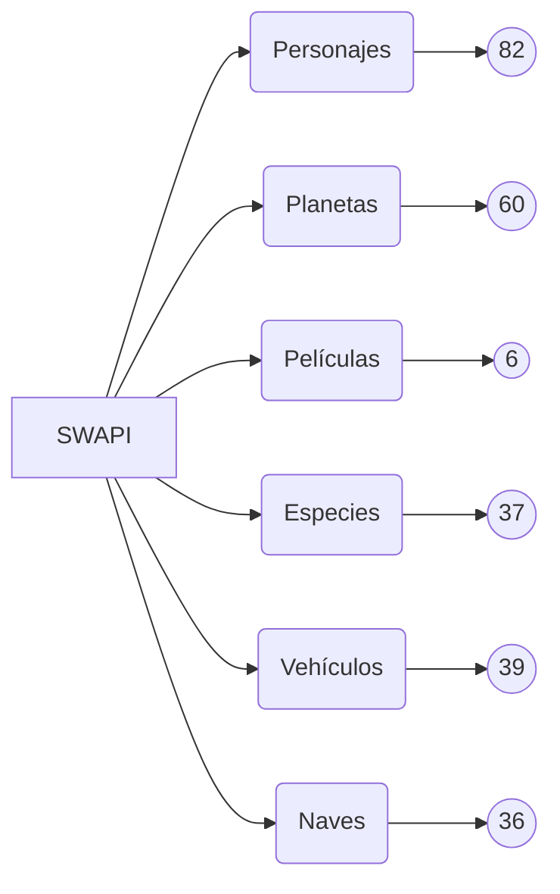

# SWAPI PROJECT 🚀
En este repositorio encontrarás el consumo de la API de Star Wars con toda informaciíon detallada de la saga completa donde contiene datos acerca de Personajes,Planetas,Películas,Especies,Vehículos y Naves.

### Tabla de contenidos 📋
| Indice | Titulo  |
|--|--|
| 1 | [Mapeo API](#mapeo) |
| 2 | [Personajes](#personajes) |
| 3 | [Planetas](#planetas) |
| 4 | [Peliculas](#peliculas) |
| 4 | [Especies](#especies) |
| 4 | [Vehiculos](#vehiculos) |
| 4 | [Naves](#naves) |

### Mapeo 🛠️
Cantidad de elementos por cada página

>[!IMPORTANT]
>Si los recursos o los datos solicitados no aparecen espera a que la informacion llegue

### Personajes 🧍
En este apartado encontrarás los 82 personajes de la saga de Star Wars

### Planetas 🪐
En este apartado encontrarás los 60 planetas de la saga de Star Wars

### Peliculas 🎬
En este apartado encontrarás las 6 peliculas de la saga de Star Wars

### Especies 👹
En este apartado encontrarás las 37 especies de la saga de Star Wars

### Vehiculos 🚜
En este apartado encontrarás los 39 vehiculos de la saga de Star Wars

### Naves 🛸
En este apartado encontrarás las 36 naves de la saga de Star Wars
